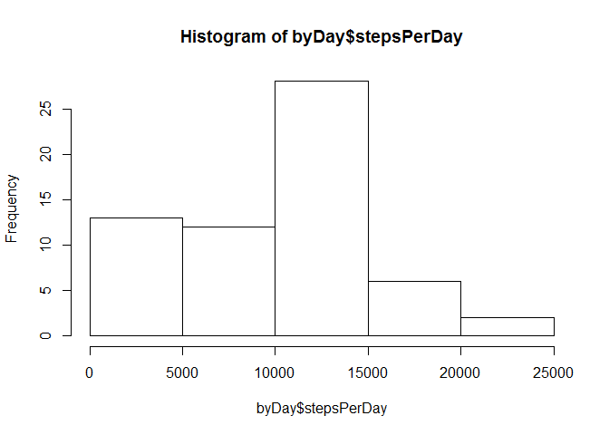
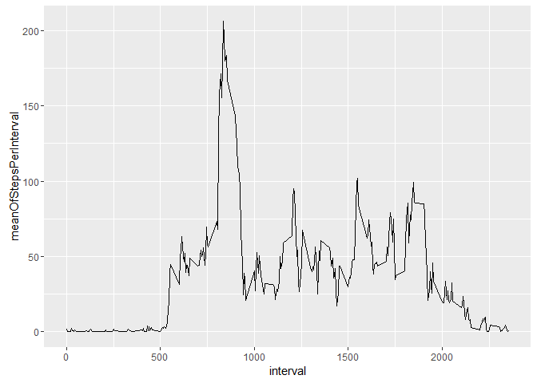
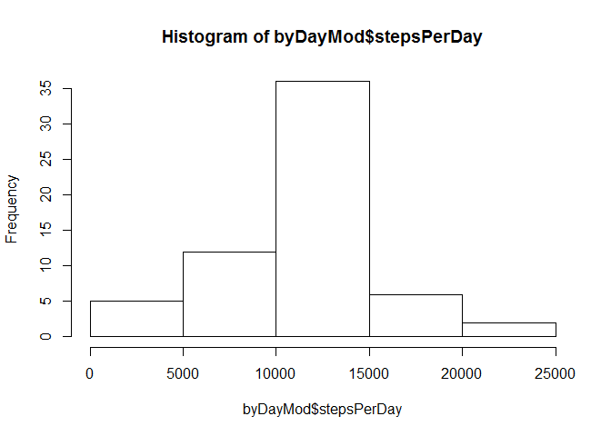
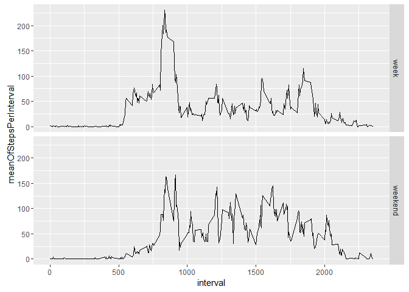

# Reproducible Research: Peer Assessment 1

This is the submission for the Peer Graded Assignment: Course Project 1 in reproducible research class.

data was obtained from [here](https://d396qusza40orc.cloudfront.net/repdata%2Fdata%2Factivity.zip)

We need some libraries:


```
## 
## Attaching package: 'dplyr'
```

```
## The following objects are masked from 'package:stats':
## 
##     filter, lag
```

```
## The following objects are masked from 'package:base':
## 
##     intersect, setdiff, setequal, union
```

```
## 
## Attaching package: 'data.table'
```

```
## The following objects are masked from 'package:dplyr':
## 
##     between, last
```

```
## 
## Attaching package: 'lubridate'
```

```
## The following objects are masked from 'package:data.table':
## 
##     hour, mday, month, quarter, wday, week, yday, year
```

```
## The following object is masked from 'package:base':
## 
##     date
```

We read it in and convert the dat to posix:


```r
setwd("C:/Users/dansch/Dropbox/coursera/R/reproduceableResearch/proj 1/")
dt<-fread(input= "activity.csv")
dt$date<-ymd(dt$date)
```

No we start the analys. 

First we sum the number of steps per day and per intervall.


```r
byDay<-dt%>%group_by(date) %>%summarize(stepsPerDay=sum(steps,na.rm=T))
byIntervall<-dt%>%group_by(interval) %>%summarize(meanOfStepsPerInterval=mean(steps,na.rm=T))
```

And now plot the histogram


```r
hist(byDay$stepsPerDay)
```

<!-- -->

And now mean of steps per day


```r
mean(byDay$stepsPerDay)
```

```
## [1] 9354.23
```

And now median of steps per day


```r
median(byDay$stepsPerDay)
```

```
## [1] 10395
```

Time series of the number of steps taken on dayly average:


```r
ggplot(byIntervall,aes(interval,meanOfStepsPerInterval))+geom_line()
```

<!-- -->

Find tha maximum Intervall:  


```r
maxVal=max(byIntervall$meanOfStepsPerInterval)
interval=byIntervall%>%filter(meanOfStepsPerInterval==maxVal)%>%select(interval)
interval
```

```
## Source: local data table [1 x 1]
## 
##   interval
##      (int)
## 1      835
```

We replace the na in tha original data with the mean over tha days which we take from byIntervall


```r
  dtMod<-dt
  for (ir in 1:nrow(dtMod)){
    if (is.na(dtMod$steps[ir])){
#      print(dtMod$interval[ir])
      replacment=round(byIntervall[interval==dtMod$interval[ir]]$meanOfStepsPerInterval)
#      print(replacment)
      dtMod[ir,steps:=replacment]
    }
  }
```


And now plot the histogram of the imputed data


```r
byDayMod<-dtMod%>%group_by(date) %>%summarize(stepsPerDay=sum(steps,na.rm=T))
hist(byDayMod$stepsPerDay)
```

<!-- -->


And now mean of steps per day


```r
mean(byDayMod$stepsPerDay)
```

```
## [1] 10765.64
```

And now median of steps per day


```r
median(byDayMod$stepsPerDay)
```

```
## [1] 10762
```

So there is a slight impac on the histogram, the mean and the average.


Now we mark tha data as weekDay and notWeekaday and stor that in anew column called weekend:


```r
dtMod$weekdays <- factor(format(dtMod$date, "%A"))
dtMod$weekend<- (dtMod$weekday %in% c("Saturday","Sunday"))
dtMod$weekend[dtMod$weekend==FALSE]<-"week"
dtMod$weekend[dtMod$weekend==TRUE]<-"weekend"
dtMod$weekend<-as.factor(dtMod$weekend)
```

And now new group by intervall and weekend


```r
byIntervallAndWeekend<-dtMod%>%group_by(interval,weekend)%>%summarize(meanOfStepsPerInterval=mean(steps,na.rm=T))%>%collect()
```

And plot separating weekend days:


```r
ggplot(byIntervallAndWeekend,aes(interval,meanOfStepsPerInterval))+geom_line()+facet_grid(weekend~.)
```

<!-- -->
